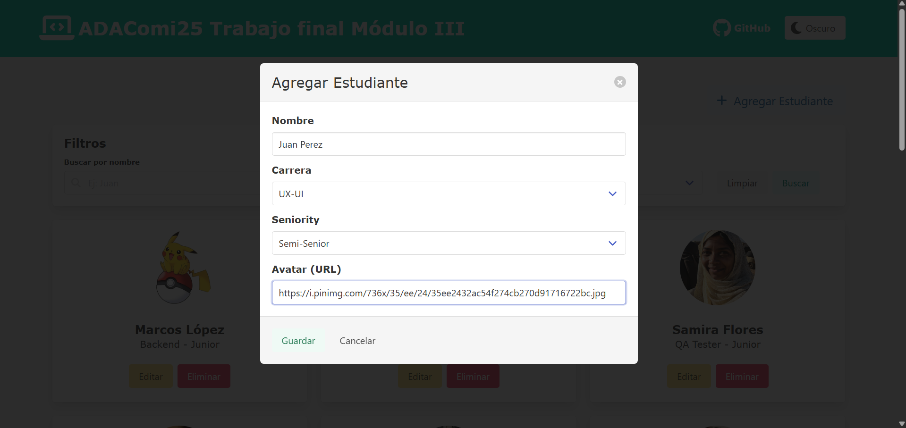
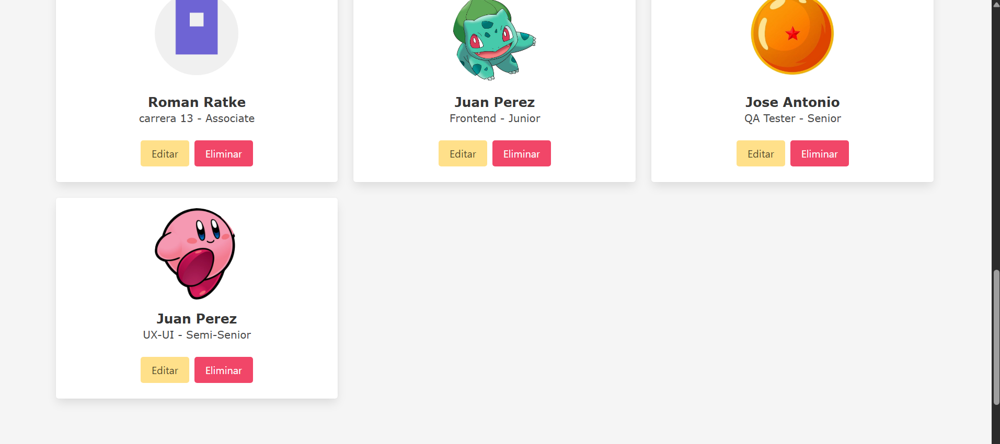
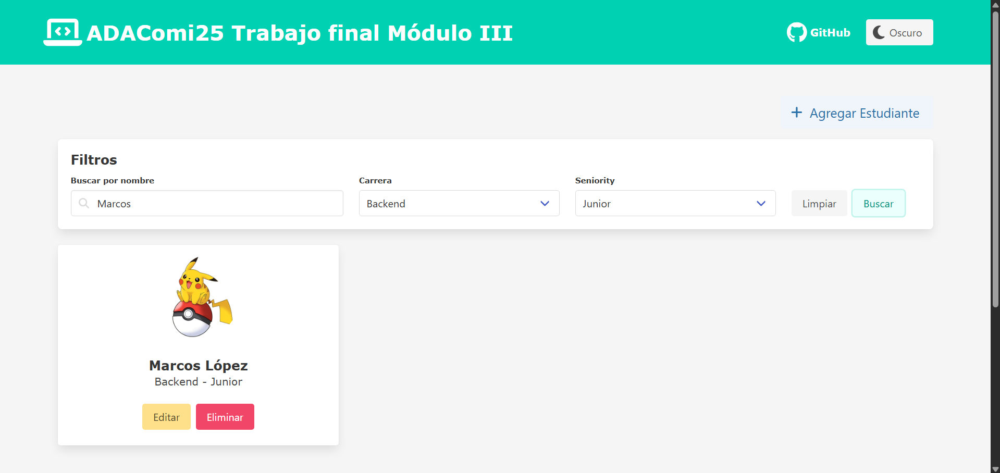
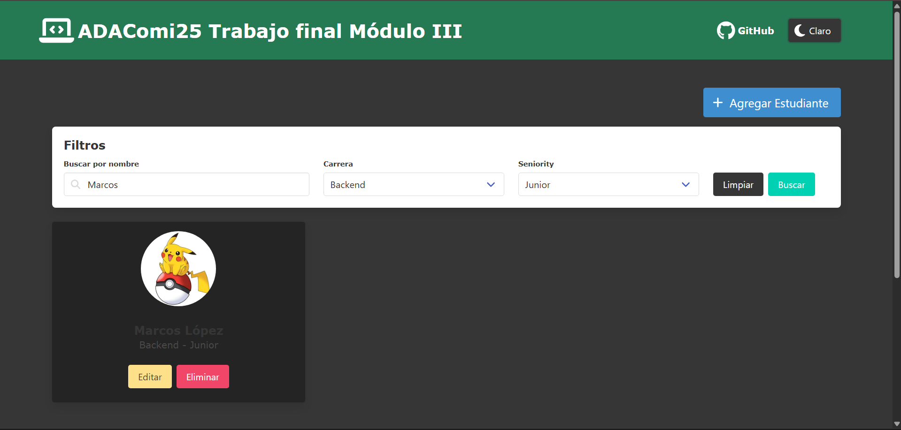

# ADAComi25 - Trabajo Final Módulo III 🎓

Este proyecto es parte del módulo III de JavaScript, con el propósito de aplicar los conocimientos adquiridos de este módulo : DOM, asincronía, y diseño visual.
Desarrollé una aplicación frontend con filtros, CRUD, modo oscuro y visuales adaptados.

## 🛠️ Proceso de desarrollo

- Modularización de funciones en archivos separados (`app.js`,`api.js`, `filters.js`, `ui.js`, `theme.js`)
- Validación visual y funcional de cada componente
- Control manual del modo oscuro y estructura de commits descriptivos
- Testing manual y documentación clara 

## 🧩 Funcionalidades

- Agregar, editar y eliminar estudiantes
- Filtros por nombre, carrera y seniority
- Modo claro/oscuro con preferencia guardada
- Loader visual y mensaje de “sin resultados”
- Diseño responsive con Bulma y FontAwesome

## 🛠️ Tecnologías

- HTML, CSS, JavaScript
- Bulma, FontAwesome
- MockAPI
- Git y GitHub
- Vercel

## 🚀 Deploy

Podés ver el proyecto online en:  
👉 [https://ada-comi25.vercel.app](https://ada-comi25.vercel.app)

## 🖼️ Capturas del proyecto

### Vista general

### Modal agregar estudiante 

### Modal de estudiante

### Filtros aplicados

### Modo oscuro

### Sin resultados

## 📬 Contacto

Creado por [Andrea Amutio](https://www.linkedin.com/in/andrea-sabrina-amutio/) ❤️  
📧 andiamutio93@gmail.com  
📍 Esquel, Chubut